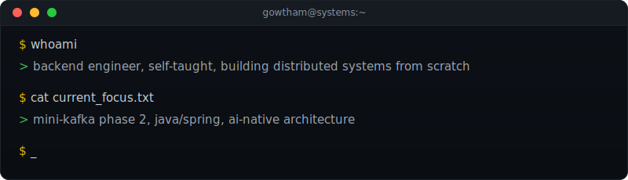

<h1 align="center">Gowtham N</h1>

<b>Backend / Platform Systems Engineer</b> — self-taught, systems-first

  

  

  
  

  

---

I build and operate **production-grade backend systems** with a focus on **distributed systems, reliability, real-time communication, and infrastructure ownership**.

My work spans designing APIs, operating Linux-based on-prem deployments, and building systems that behave correctly under failure — including AI-native infrastructure treated as a distributed systems problem, not just a prompting problem.

Currently working as a **Software Engineer (Backend / Platform)**, and actively deepening my Java, distributed systems, and AI-native architecture knowledge.

---

## 🔧 What I Work On

- **Production backend systems** using Node.js, TypeScript, PostgreSQL, Redis
- **Real-time systems** (WebSockets, async pipelines, event-driven architecture)
- **AI-native infrastructure** — LLM gateways, queueing, concurrency control, and reliability patterns for AI systems
- **Distributed & monitoring-style systems** (health checks, quorum logic, fault tolerance)
- **Infrastructure & operations**: Linux, Docker, NGINX, PM2, CI/CD
- **Correctness & reliability**: auditability, performance tuning, failure handling

---

## 🧠 Featured Projects

### **Mini-Kafka — Custom Message Broker**
A Kafka-modeled message broker built from scratch in Java — append-only log storage, memory-mapped I/O, and lock-free concurrent writes using CAS operations. Phase 2 in progress: log segmentation, CRC32 checksums, and crash recovery.
📖 [Read the write-up](https://github.com/Gowtham-beep/Gowtham-Writes/blob/main/mini-kafka.md)

### **AI MLOps Experiment Labs**
Self-directed labs treating LLM inference as a distributed systems problem rather than a prompting problem — bounded concurrency, queue/worker decoupling, rate limiting, and rigorous cross-validated benchmarking. Lab #1 proved that concurrency improved batch throughput ~4.7x while worsening individual request latency.
🔗 [github.com/Gowtham-beep/AI-LABS](https://github.com/Gowtham-beep/AI-LABS)

### **SAP Order-to-Cash Context Graph + LLM Query Interface**
A context graph over SAP O2C relational data with a natural language query interface built using Groq LLaMA 3.3 70B — shipped in 3.5 days with zero prior SAP domain knowledge. Implemented a two-pass LLM architecture and a zero-shot intent classifier to fix query context bleed.
🔗 [github.com/Gowtham-beep/dodge-o2c-graph](https://github.com/Gowtham-beep/dodge-o2c-graph)

### **SentinelMesh — Distributed Uptime & Health Monitoring**
A distributed monitoring platform with independent workers and quorum-based verification to eliminate false positives. Focuses on fault tolerance, idempotent alerting, and control-plane style decision logic.
🔗 [Live demo](https://sentinel-mesh-sentinel-mesh.vercel.app/)

### **Durable Logger**
A fault-tolerant logging system built with Write-Ahead Logging (WAL), supporting crash recovery, replay, rotation, and retention. Explores storage durability and failure recovery patterns.

---

## ✍️ Writing & Blogs

> *"I write to anchor my knowledge and share the 'raw physics' of engineering. From breaking bare-metal storage engines to wrestling with distributed quorum, I document the struggle because that's where the real learning happens."*

Check out my latest technical deep dives here:
👉 **[Gowtham Writes](https://github.com/Gowtham-beep/Gowtham-Writes)**

**Latest Post:** [I built a message broker from scratch. Here's what broke me.](https://github.com/Gowtham-beep/Gowtham-Writes/blob/main/mini-kafka.md)

---

## 🛠 Tech Stack

**Languages:** TypeScript, JavaScript, Java, Python
**Backend:** Node.js, Fastify, Express, NestJS, WebSockets, BullMQ
**Databases:** PostgreSQL, MySQL, Redis
**Infra:** Linux, Docker, NGINX, GitHub Actions, PM2
**AI/LLM:** Groq, Ollama, LLM Gateway design, prompt-context engineering
**Concepts:** Distributed Systems, Monitoring, Reliability, Fault Tolerance, RBAC, Auditability

---

## 📫 Reach Me

- 📧 **Email:** gn86923@gmail.com
- 💼 **LinkedIn:** [linkedin.com/in/gowtham-n-19ab39257](https://www.linkedin.com/in/gowtham-n-19ab39257/)
- 🧑‍💻 **GitHub:** [github.com/gowtham-beep](https://github.com/gowtham-beep)
